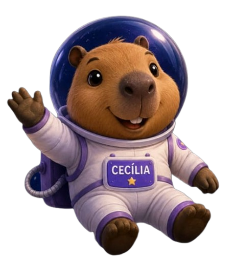

  

<h1 align="center">✨ Cecília nas Estrelas ✨</h1>

  Uma plataforma educacional interativa que aproxima crianças e jovens da ciência por meio da Astronomia, da curiosidade, da narrativa e da imaginação.

   Em desenvolvimento • React Native • Expo • TypeScript

## Sobre o projeto

O Cecília nas Estrelas nasceu com a proposta de transformar o aprendizado científico em uma experiência acolhedora, divertida e investigativa.

Mais do que ensinar Astronomia, a plataforma busca despertar a curiosidade, incentivar a observação e promover a alfabetização científica por meio de histórias, desafios, gamificação e experiências interativas.

No centro desse universo está Cecília, uma capivarinha curiosa e apaixonada pelo céu, acompanhada por seus amigos, que transformam cada descoberta em uma nova aventura.

## Objetivos

Incentivar a curiosidade científica.

Aproximar crianças da Astronomia e das Ciências da Terra.

Promover a alfabetização científica.

Tornar o aprendizado mais lúdico e interativo.

Unir ciência, imaginação e tecnologia.

## Funcionalidades

Login

Cadastro

Entrar como visitante

Sistema Solar

Progresso do aluno

Quiz

Medalhas

Ranking

Painel do professor

Salvamento de progresso

Personalização

IA da Cecília

## Funcionalidades futuras

Trilhas de aprendizagem

Biblioteca Cósmica

Observatório Virtual

Diário de Bordo

Histórias interativas

Gamificação avançada

## Personagens

Cecília

Cosmo

Melinda

Aurora

Luna

Tito

Téo

Henrique

Carmem

Lucas

Nuri

## Tecnologias

Atualmente:

React Native

Expo

TypeScript

Expo Router

Git

GitHub

Planejadas:

Firebase

Firestore

APIs de Astronomia

Inteligência Artificial

## Estrutura do projeto

app/

assets/

components/

constants/

hooks/

## Como executar

Clone o projeto: git clone https://github.com/SEU-USUARIO/cecilia-nas-estrelas.git

Entre na pasta: cd cecilia-nas-estrelas

Instale as dependências: npm install

Execute: npx expo start

## Telas

Em breve serão adicionadas imagens do aplicativo.

## Filosofia

Aprender nunca significa apenas encontrar respostas.

Aprender significa observar. Perguntar. Experimentar. Compartilhar. E descobrir que o Universo sempre guarda uma nova pergunta esperando por nós

## Roadmap

Identidade visual

Tela Inicial

Tela de Boas-vindas

Sistema Solar

Missões

Quiz

Ranking

Medalhas

IA da Cecília

## Equipe

Joanne Garcia Azevedo

Larissa Barbosa Simas

Maria Regina Garcia Duarte

## Licença

Projeto acadêmico e autoral.

Os personagens, textos, universo narrativo e demais elementos são protegidos por direitos autorais.

"Se este projeto fez você olhar para o céu com um pouco mais de curiosidade, então a missão da Cecília já começou."

